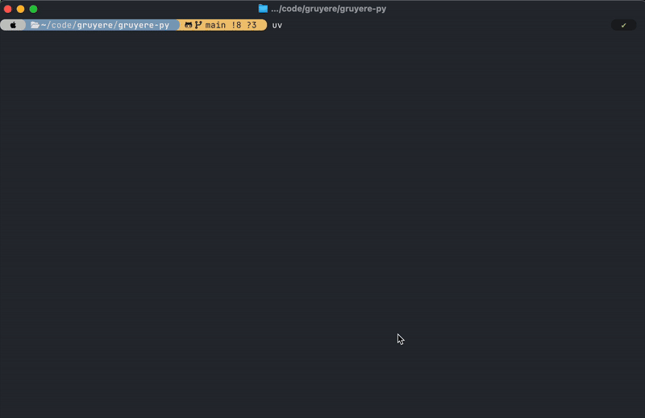

# gruyere 🧀
A tiny program for viewing + killing ports. 

It's called "gruyere" because ports reminded me of holes and gruyere is a cheese with many holes! 🧀

gruyere makes use of the wonderful [Charm](https://github.com/charmbracelet) libraries:
- [Bubble Tea](https://github.com/charmbracelet/bubbletea)
- [Bubbles](https://github.com/charmbracelet/bubbles)
- [Lip Gloss](https://github.com/charmbracelet/lipgloss)
- [Log](https://github.com/charmbracelet/log)

## Requirements
To build:
- Go 1.20+