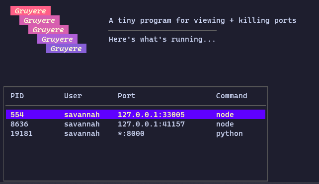

# Gruyere 🧀
A tiny program for viewing + killing ports. Built with https://github.com/charmbracelet/bubbletea and https://github.com/charmbracelet/lipgloss.

It's called "Gruyere" because ports reminded me of holes and Gruyere is a cheese with many holes! 🧀

## TODOs
- [x] View all ports listening and list PID, user, port and program
- [ ] Select a port to kill it (with confirmation)
- [ ] Search for port (fuzzy matching? Good for if you have a lot of stuff running?)